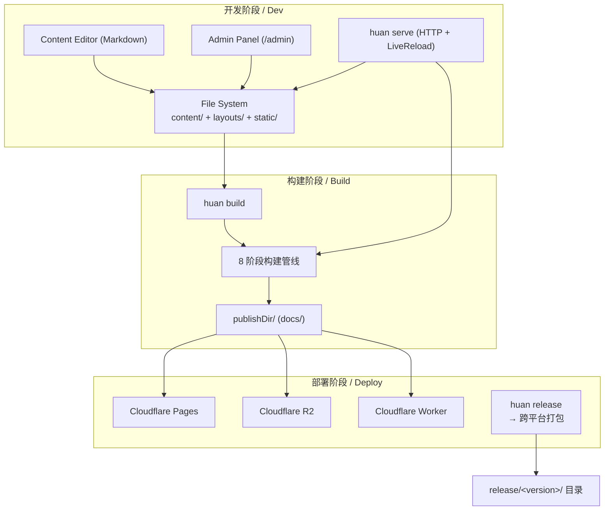

# huan — Project Blueprint

## 系统全景 / System Overview

- **项目类型**: CLI Tool + HTTP Server (SSG + Content Engine)
- **一句话描述**: 基于 Go 的 local-first single-user content engine，内置管理后台与静态站点生成管线
- **技术栈**:
  - 后端: Go 1.26，Cobra CLI，html/template，goldmark（Markdown 渲染）
  - 数据库: 无——所有内容以文件系统为存储（Markdown + YAML 配置）
  - 前端: React 19 + Shadcn UI + Tailwind CSS + Vite（嵌入式 SPA）
  - 部署: 单二进制部署（CGO_ENABLED=0），可选 Docker 镜像
- **架构红线 / Architectural Rules**:
  1. 所有时间戳使用 UTC，所有日期字段解析为 `time.Time`
  2. 业务异常统一格式（JSON 结构体 + HTTP 状态码）
  3. 数据库操作通过 Repository 模式（当前为文件系统 CRUD）
  4. 模板函数必须可测试，无静默 no-op 行为
  5. 构建管线通过固定 8 阶段流水线执行，不可跳过
  6. 插件系统使用 capability 接口，分散在领域包中，不集中定义

## 核心数据字典 / Core Data Dictionary

### Page（内容页面）
| 字段 | 类型 | 约束 | 说明 |
|------|------|------|------|
| Title | string | — | 页面标题（frontmatter） |
| Date | string | ISO 8601 | 原始日期字符串 |
| DateParsed | time.Time | — | 解析后的日期（用于排序/模板） |
| Draft | bool | — | 草稿标记 |
| Hidden | bool | — | 隐藏标记 |
| Type | string | — | 内容类型，默认等于 Section |
| Slug | string | — | URL slug |
| Section | string | — | 所属 section（posts, books 等） |
| Kind | string | page/section/home/taxonomy/term | 页面类型 |
| Language | string | zh-cn / en | 语言代码 |
| Tags | []string | — | 标签 |
| FilePath | string | — | 源文件绝对路径 |
| RelPath | string | — | 相对于 content/ 的路径 |
| URL | string | — | 渲染后的相对 URL |
| Content | string | — | 渲染后的 HTML |
| Summary | string | — | 截断后的摘要 HTML |
| Plain | string | — | 纯文本内容 |
| WordCount | int | — | 字数（CJK 友好） |
| Weight | int | — | 排序权重 |
| Parent | *Page | — | 父级 section 页面 |
| Pages | []*Page | — | 子页面（section 下直接子页面） |
| RegularPages | []*Page | — | 常规子页面（不含子 section） |
| RegularPagesRecursive | []*Page | — | 递归所有子页面 |
| Sections | []*Page | — | 子 section 页面 |
| RawContent | string | — | 原始 Markdown 正文 |

### Site（站点上下文）
| 字段 | 类型 | 约束 | 说明 |
|------|------|------|------|
| Title | string | — | 站点标题 |
| BaseURL | string | — | 基础 URL |
| Language | string | zh-cn / en | 默认语言 |
| Params | map[string]interface{} | — | 自定义参数 |
| Menus | map[string][]MenuItem | — | 导航菜单 |
| Pages | []*Page | — | 所有页面 |
| RegularPages | []*Page | — | 所有常规页面 |
| Data | map[string]interface{} | — | data/*.yaml 加载结果 |
| Taxonomies | map[string]Taxonomy | — | 分类法 |
| Config | *Config | — | 全局配置引用 |

### Config（huan.yaml 配置）
| 字段 | 类型 | 约束 | 说明 |
|------|------|------|------|
| BaseURL | string | required | 站点基础 URL |
| Title | string | — | 站点标题 |
| LanguageCode | string | — | 默认语言代码 |
| PublishDir | string | — | 输出目录 |
| Paginate | int | — | 每页文章数 |
| Minify | bool | — | 是否压缩输出 |
| HasCJKLang | bool | — | 是否包含 CJK 内容 |
| Languages | map[string]LanguageConfig | — | 多语言配置 |
| Menu | map[string][]MenuItem | — | 菜单配置 |
| Markup | MarkupConfig | — | Markdown 渲染配置 |
| Plugins | map[string]map[string]any | — | 插件配置 |
| AI | AIConfig | — | AI 友好输出配置 |

### BuildConfig（构建控制）
| 字段 | 类型 | 约束 | 说明 |
|------|------|------|------|
| List | string | never/always | 是否出现在列表页 |
| Render | string | never/always | 是否渲染 |
| PublishResources | bool | — | 是否发布资源 |

### LanguageConfig（语言配置）
| 字段 | 类型 | 约束 | 说明 |
|------|------|------|------|
| Title | string | — | 语言特定标题 |
| LanguageCode | string | — | 语言代码 |
| ContentDir | string | — | 内容目录（默认与主目录相同） |
| Weight | int | — | 语言权重 |
| Params | map[string]interface{} | — | 语言特定参数 |
| ExcludeSections | []string | — | 隐藏的 section 列表 |
| CatalogSections | []string | — | 目录模式 section 列表 |
| NeutralSections | []string | — | 中性 mode section 列表 |

## 架构模式 / Architecture Patterns

| 模式 | 状态 | 说明 |
|:----|:----:|:------|
| 流水线架构 | ✅ | 8 阶段固定顺序构建流水线 |
| 插件系统 | ✅ | Capability 接口 + Registry，当前有 Deployer + Translator |
| 文件系统即数据层 | ✅ | 所有内容以 Markdown 文件存储，无需数据库 |
| BFF（Admin API） | ✅ | 管理后台通过 Go JSON API 操作文件系统 |
| 事件驱动（文件变更） | ✅ | fsnotify 监听 + 防抖 + 原子重建 |
| 多站点构建 | ✅ | 基于语言配置的多站点并行构建 |
| 原子部署 | ✅ | swap(2) 原子替换发布目录 |
| 双层记忆系统 | ✅ | 每日笔记（流）+ 长期记忆（沉积） |

## 部署架构 / Deployment Architecture



## 领域词汇表 / Domain Glossary

| 术语 | 英文 | 定义 | 边界/说明 |
|------|------|------|-----------|
| 内容 | Content | 站点的基本单元，一个 Markdown 文件 | 不是配置、不是模板、不是静态资源 |
| 页面 | Page | 渲染后的内容，包含 HTML/元数据/URL | 一个内容文件 → 一个页面（可能多个输出格式） |
| 站点 | Site | 整个站点的上下文，包含所有页面/配置/数据 | 不含模板实现细节 |
| Section | Section | 内容分类，对应 content/ 下的子目录 | 不含 taxonomy |
| 分类法 | Taxonomy | 标签/分类的聚合系统 | 当前仅支持 tags |
| 模板 | Template | Go html/template 文件，控制输出 HTML | 不含数据逻辑 |
| 短代码 | Shortcode | Markdown 中可嵌入的 Go 组件 | 类似 Hugo shortcode，当前有 audio/img |
| 配置 | Config | huan.yaml 定义的站点配置 | 不可运行时修改 |
| 构建管线 | Build Pipeline | 8 阶段固定顺序的构建流程 | 不可跳过任一阶段 |
| 插件 | Plugin | 实现特定 Capability 接口的扩展模块 | 必须注册到 Plugin Registry |
| 部署器 | Deployer | 将站点发布到远程平台的插件能力 | 当前实现：Cloudflare Pages/R2/Worker |
| 翻译器 | Translator | 将内容翻译为目标语言的插件能力 | 当前实现：Qwen3 |
| 多站点 | MultiSite | 基于语言配置，为每种语言构建独立站点 | 共享内容源，独立输出目录 |
| 原子交换 | Atomic Swap | 通过 rename(2) 实现无中断的目录替换 | 先写入 staging 目录，再 swap 到目标 |
| 等价性 | Equivalence | huan 输出与 Hugo 输出在三维度上的对比 | 肉眼/SEO/AI 三维度门禁 |
| 管理后台 | Admin Panel | huan serve 内置的 /admin 路由 | 仅本地开发访问，非生产功能 |

### 词汇规范
- 代码类名/表名使用 **英文术语**（Page, Site, Config, Section, Taxonomy）
- API 路径使用 **英文术语**（/admin/api/content, /admin/api/settings）
- 中文文档中使用 **中文术语**

## 构建管线 / Build Pipeline

### 8 阶段流水线

```
BuildSite(opts)
│
├── Stage 1: loadConfig()           — 加载 huan.yaml + serve 覆盖 + i18n 注入
│   ├── config.Load(opts.SourceDir)
│   ├── 应用 opts.BaseURLOverride / MinifyOverride
│   └── 注入 site_translations 到 params
│
├── Stage 2: loadContent()          — 加载内容 + 数据 + 多语言过滤
│   ├── content.LoadDir() 扫描 content/**/*.md
│   ├── 解析 frontmatter (YAML)
│   ├── 应用 opts.PageFilter（多语言过滤）
│   ├── 加载 data/*.yaml
│   └── 检查 stale translations
│
├── Stage 3: renderMarkdownAndTree() — 短代码展开 + Markdown 渲染 + 内容树
│   ├── 展开 shortcode（audio/img）
│   ├── goldmark 渲染 Markdown → HTML
│   ├── 构建内容树（section 层级 + parent/child）
│   ├── 处理 cascade 继承
│   └── 构建 taxonomy
│
├── Stage 4: setupTemplatesAndWriter() — 模板 + i18n + 写入器
│   ├── 加载 layouts/ 模板
│   ├── 注册模板函数（~40+ 函数）
│   ├── 加载 i18n bundle
│   └── 创建 Writer（minify + canonify）
│
├── Stage 5: buildContexts()        — 构建 SiteContext + 每个页面的 Context
│   ├── 构建 SiteContext
│   ├── 为每个 Page 构建 Context
│   └── 建立链接关系（translationLinks）
│
├── Stage 6: renderPages()          — 渲染 HTML 页面 + Markdown 镜像 + section RSS
│   ├── 渲染每个 Page（single.html / list.html）
│   ├── 生成 Markdown mirror（index.md）
│   └── 生成 section RSS
│
├── Stage 7: renderFeedsAndSpecials() — taxonomy + 分页 + 特殊输出
│   ├── taxonomy list/term 页面
│   ├── 分页页面（/page/N/）
│   ├── 404 页面
│   ├── sitemap.xml
│   ├── search.json
│   ├── llms.txt
│   └── 内容 API（/api/{section}.json）
│
└── Stage 8: copyStaticAndFinalize() — 复制静态资源 + 统计
    ├── 复制 static/ 目录
    ├── 复制主题静态资源
    ├── 统计 PagesRendered / FilesWritten / BytesWritten
    └── 返回 Result
```

## API 契约 / API Contracts

### Admin API（`/admin/api/`）

| 方法 | 路径 | 说明 | MVP |
|:----:|------|------|:---:|
| GET | /admin/api/status | 站点概览统计 | ✅ |
| GET | /admin/api/content | 内容列表（搜索/排序/筛选） | ✅ |
| POST | /admin/api/content | 新建内容 | ✅ |
| GET | /admin/api/content/{path} | 读取单条内容 | ✅ |
| GET | /admin/api/content/{path}/languages | 获取同系列语言版本 | ✅ |
| PUT | /admin/api/content/{path} | 更新内容 | ✅ |
| DELETE | /admin/api/content/{path} | 删除内容 | ✅ |
| POST | /admin/api/build | 触发站点重建 | ✅ |
| GET | /admin/api/media | 媒体文件列表 | ✅ |
| POST | /admin/api/media | 上传媒体文件 | ✅ |
| DELETE | /admin/api/media/{path} | 删除媒体文件 | ✅ |
| GET | /admin/api/settings | 获取站点配置（JSON） | ✅ |
| PUT | /admin/api/settings | 更新站点配置（JSON） | ✅ |
| GET | /admin/api/settings/yaml | 获取原始 huan.yaml | ✅ |
| PUT | /admin/api/settings/yaml | 更新原始 huan.yaml | ✅ |

### 内容 API（`/api/{section}.json`）

| 方法 | 路径 | 说明 | MVP |
|:----:|------|------|:---:|
| GET | /api/{section}.json | 按 section 输出 JSON 内容列表 | ✅ |

### 鉴权

- `HUAN_ADMIN_TOKEN` 环境变量控制
- 非 loopback 绑定（0.0.0.0）强制要求显式 Token
- loopback 绑定自动生成一次性 Token
- Bearer Token 通过 `Authorization` 或 `X-Huan-Admin-Token` 头传递
- 使用 `crypto/subtle.ConstantTimeCompare` 防时序攻击

## 前端设计方向 / Frontend Design Direction

### 设计基调
管理后台采用极简单色设计，Vercel 风格——黑白灰为主，信息密度中等，功能优先。

### 排版方向
- **标题字体**: Geist / Inter — 现代化无衬线字体
- **正文字体**: Geist / Inter — 与标题一致，保持视觉统一

### 色彩方向
- **主色**: 白色/浅灰背景 — 内容区域
- **辅助色**: #18181B (zinc-900) — 导航/侧边栏
- **强调色**: #3B82F6 (blue-500) — 操作按钮/链接
- **危险色**: #EF4444 (red-500) — 删除操作

### 设计原则
1. **数据优先** — 让数字和状态一目了然，减少装饰性元素
2. **操作意图明确** — 每个按钮明确告知后果（删除需二次确认 Dialog）
3. **保持克制** — 不为装饰而装饰，复杂功能隐藏在次级菜单/模态框

## 已固化的结构里程碑 / Solidified Milestones

1. **[x] 里程碑 1**: 项目骨架 + 配置系统（CLI 入口 + huan.yaml 解析）
2. **[x] 里程碑 2**: 内容加载 + Markdown 渲染（goldmark + content tree）
3. **[x] 里程碑 3**: 模板系统（html/template + 40+ 函数注册）
4. **[x] 里程碑 4**: Shortcode + 加密系统（audio/img；encrypt v0.2.0 移除）
5. **[x] 里程碑 5**: 列表页 + Taxonomy + 分页
6. **[x] 里程碑 6**: 辅助输出（RSS/sitemap/search.json）
7. **[x] 里程碑 7**: Minify + 输出优化
8. **[x] 里程碑 8**: 验证 + 修正（Hugo diff 管线）
9. **[x] 里程碑 9**: 开发服务器（serve + LiveReload）
10. **[x] 里程碑 10**: chroma 语法高亮 port
11. **[x] 里程碑 11**: 三维度等价 PASS（SEO + AI 全 0 diff）
12. **[x] 里程碑 12**: i18n 多语言系统（Translator 插件 + 双语构建 + 模板 helpers）
13. **[x] 里程碑 13**: Admin Panel（Go API + React SPA）
14. **[x] 里程碑 14**: v1.0 hard gates（文档定位 + no-op 函数 + 测试 + 安全边界 + BuildSite 拆分）

## 架构决策记录 / Architecture Decision Records

- `docs/adr/0001-redefine-equivalence.md` — 重新定义三维度等价标准
- `docs/adr/0002-cloudflare-deploy-plugin.md` — Cloudflare 部署插件设计
- `docs/adr/0003-unified-plugin-system.md` — 统一插件系统架构
- `docs/adr/0004-release-command.md` — 本地打包发布命令
- `docs/adr/0005-remove-encrypt-and-v02-feature-batch.md` — 移除未启用的加密功能
- `docs/adr/0006-remove-encryptgroups-dead-config.md` — 移除 encryptGroups 死配置
- `docs/adr/0007-i18n-build-system.md` — i18n 多语言构建系统
- `docs/adr/0008-translator-capability-qwen3-plugin.md` — Qwen3 翻译插件
- `docs/adr/0009-self-contained-downstream-deploys.md` — 自包含下游部署
- `docs/adr/0010-v1-0-scope-and-positioning-split.md` — v1.0 范围与定位拆分
- `docs/adr/0011-admin-security-boundary.md` — 管理后台安全边界

## 测试策略 / Testing Strategy

- **测试框架**: Go 标准库 testing（+ testify 风格的辅助函数，无第三方依赖）
- **测试类型**: 单元测试（核心逻辑）+ 集成测试（API/文件系统）+ 特性测试（admin 端点）
- **覆盖率目标**: 核心业务逻辑 > 80%，整体 > 60%

### 测试纪律
1. 每个结构里程碑必须有对应的测试
2. 测试与代码同时提交
3. 所有测试通过后才能合入
4. 禁止静默 no-op 的模板函数

## 文档规范 / Documentation Conventions

- **README**: 中英双语，项目介绍、安装指南、快速开始、项目结构
- **CHANGELOG**: 通过 Git 提交历史管理
- **API 文档**: 代码注释 + README 中维护
- **文档纪律**: 变更与文档同时提交，不允许"先提代码，文档后补"
- **文档模板**: 参考 `docs/templates/`
- **进展文档**: 未完成保存到 `docs/progress/`，已完成保存到 `docs/reports/completed/`

## 部署方案 / Deployment Plan

- **运行方式**: 单二进制（CGO_ENABLED=0），可选 Docker 容器
- **部署平台**: Cloudflare Pages / R2 / Worker（通过插件系统）
- **容器化**: 支持 Docker（debian:bookworm-slim 基础镜像）
- **CI/CD**: GitHub Actions（v* tag 自动建 Release）
- **环境变量**: `HUAN_ADMIN_TOKEN`（管理后台鉴权）

## 当前进度 / Current Progress

- **当前版本**: v0.5.0
- **状态**: 6 个 v1.0 hard gate 中 5 个已交付，等待 gate 6（90 天生产稳定性至 2026-09-11）
- **下一步**: 2026-09-11 后发布 v1.0.0
- **后续方向**:
  - Admin 认证系统完善
  - 从其他 CMS（WordPress / Ghost / Strapi）的迁移工具
  - 多用户协作支持
  - 媒体库管理增强（在线裁剪/上传）
  - Admin 内集成 deploy 配置